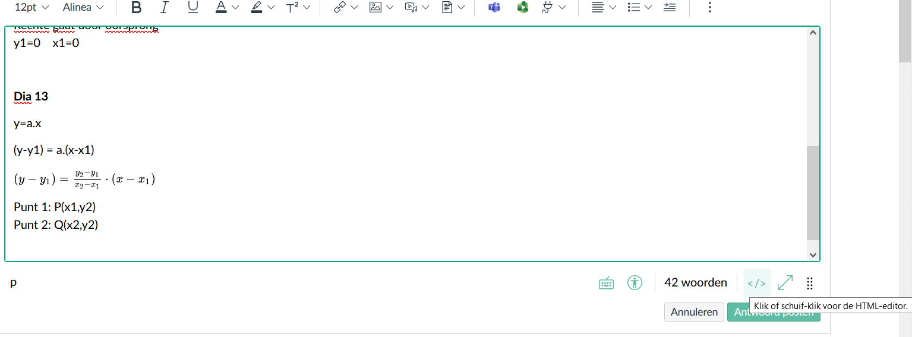

# Cats Mathematics Notes (README)

## How to make digital notes in mathematics class

Writing stuff like

in pure text would be a pain. Luckily, we can leverage the power of **Canvas**!
When commenting in certain parts of Canvas, you have a built-in maths pane, which - when you type `y1-y2/x2-x1` it converts it to the thing above!

### How to backup these notes

Click the button here to get the HTML editor, and simply copy paste the contents into a .html or (when using Github Pages/Jekyll like this website) a .md file.

Oh, and replace `src="/equation_images` with `src="https://canvas.kdg.be/equation_images` (or whatever your Canvas domain is) to change the relative links into, non relative ones. Or ideally, save the images locally! But I'm still working on a system to do that swiftly.

### "Advanced" tips for the Canvas math editor

- You can use * and / on your keyboard, and it'll auto convert
- It uses Latex, so typing `\Delta` and `\sqrt` will allow you to circumvent having to use buttons

## License

These are math notes put into a basic website, leveraging GitHub Pages and the Canvas editor to compensate for my inability in handwriting. [MIT License](LICENSE), use this knowledge however you please, contribute however much you want, just don't hold me liable.

