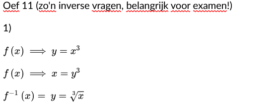
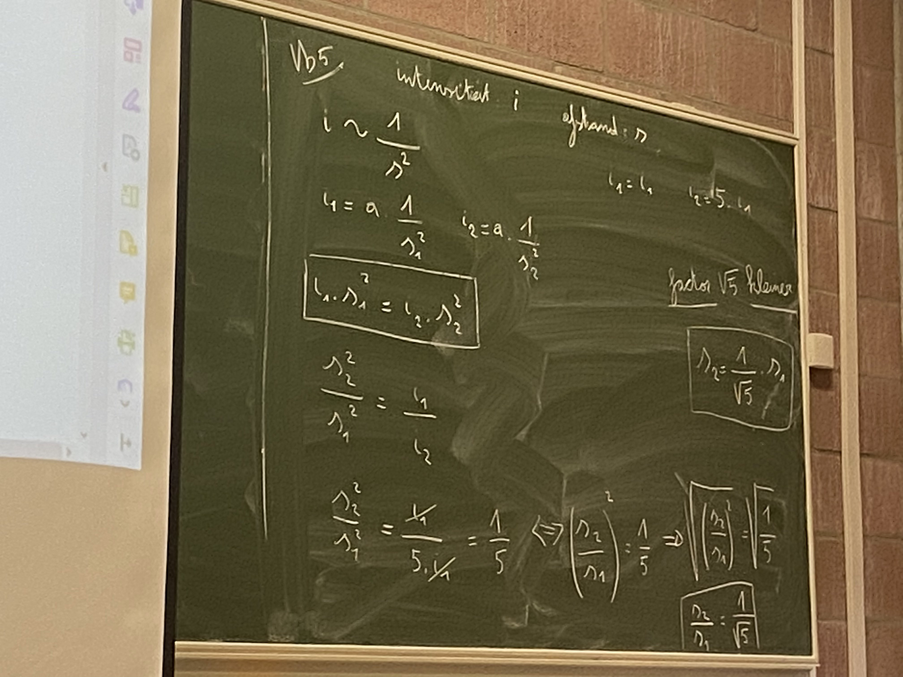
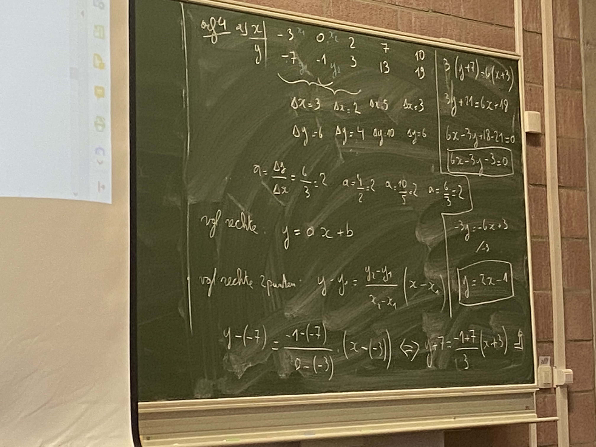
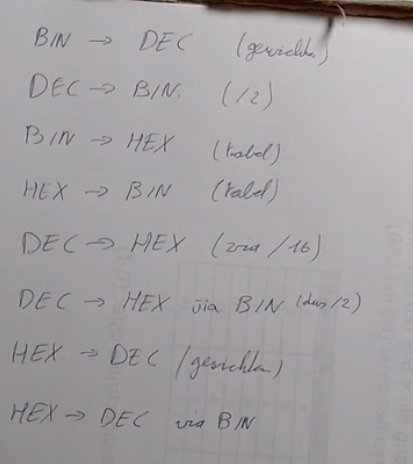

In de les wordt er af en toe gezegd van een vraag/gegeven dat het op het examen komt. So here's an attempt to write down the things!

(Also zie de notes op [de main page](../) voor general info over het examen)

---

Deze formules kunnen gevraagd worden:

- Oppervlakte cirkel (pi\*r²)
- Omtrek cirkel: 2\*pi\*r

---

---

Rundown of all the methods for getalstelsels (chapter 9):

