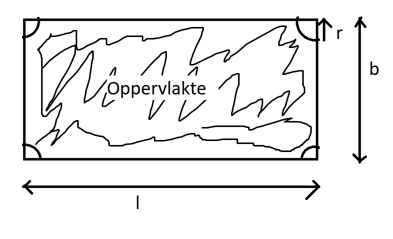
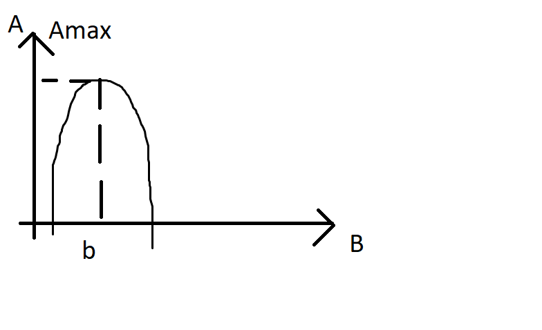

(1)

1 eenheid naar links

5 eenheden naar onder

uitrekken met factor 4

&nbsp;

&nbsp;

(2)

Luke Aikins

k = a . v&sup2; k -&gt; gewicht a -&gt; evenredigheidsfactor v -&gt; valsnelheid

75 = a.194&sup2; 

 &nbsp;&nbsp;&nbsp;&nbsp;&nbsp;&nbsp;&nbsp;&nbsp;&nbsp;&nbsp;&nbsp;&nbsp;&nbsp;&nbsp;&nbsp;&nbsp;&nbsp;&nbsp;&nbsp;&nbsp;&nbsp;&nbsp;&nbsp;&nbsp;&nbsp;&nbsp;&nbsp;&nbsp;&nbsp;&nbsp;&nbsp; \_-&gt; 

&nbsp;

&nbsp;

(3)

 (een andere persoon van 90 kg)

&nbsp;

(3) maar W R O N G

   DING DONG WRONG BONG

&nbsp;

&nbsp;

(4)

(1) { 2x+7y = 21 (2) { 4x-6y = 15

Substitutie

(1) --&gt; 7y = 21 -2x 

 --&gt; !!!! - * - = +

&nbsp;

In (2)  &nbsp;--&gt; schrap 6 naar 3, 40 naar 20

&nbsp;

<strong>Andere methode: combinatie!</strong>

&nbsp;{ 2x + 7y = 21&nbsp;&nbsp; | * (-2) &nbsp;{ 4x - 6y = 15&nbsp;&nbsp;&nbsp; | * 1 +_______________

4x+(-2)*2x-6y+(-2)*7y = (-2)*21+15 4x-4x-6y-14y = -42 + 15 

&nbsp;

&nbsp;

(5) Op 1 september is de prijs v.e. liter benzine met 25 &euro;cent gedaald

b. Prijs per liter in augustus

a. vgl?

Je tankte op 10 sept 52l benzine voor 80&euro;

&nbsp;&nbsp;&nbsp;&nbsp;&nbsp; x-&gt; prijs augustus&nbsp;&nbsp; 0,25 -&gt; stijging

52 . (x-0,25) = 80

&nbsp;

&nbsp;

(6)

&nbsp;&nbsp;&nbsp; 

&nbsp; &nbsp; 

&nbsp;

&nbsp;

(7) Bepaal de productvorm

f: 

 &nbsp;&nbsp;&nbsp;&nbsp;&nbsp;&nbsp; ___&nbsp;&nbsp;&nbsp;&nbsp;&nbsp;&nbsp;&nbsp;&nbsp;&nbsp; _&nbsp;&nbsp;&nbsp;&nbsp;&nbsp;&nbsp; _ &nbsp;&nbsp;&nbsp;&nbsp;&nbsp;&nbsp;&nbsp; a&nbsp;&nbsp;&nbsp;&nbsp;&nbsp;&nbsp;&nbsp;&nbsp;&nbsp;&nbsp;&nbsp; b&nbsp;&nbsp;&nbsp;&nbsp;&nbsp;&nbsp; c

discriminant D : b&sup2;-4ac = (-4)&sup2;-4*(-4)*(-1) &nbsp;&nbsp;&nbsp; = 16 - 16 = 0

 &nbsp; &nbsp; &nbsp; &nbsp;

&nbsp; &nbsp; &nbsp; &nbsp; 

&nbsp;

&nbsp;

(8)

 &nbsp;&nbsp; omtrek rechthoek = R0

A= opp [_] - opp O = 

Omtrek cirkel = 2pi*r Opp cirkel = pi*r&sup2; = (DOORSTREEPT:) pi*D&sup2;/4

omtrek: 120 = 2*b+2*l

max waarde:

&nbsp;

&nbsp;

Fouten gemaakt door anderen:

x2  INCORRECT

-----

 WRONG

&nbsp; &nbsp; &nbsp; &nbsp; &nbsp; &nbsp; &nbsp; NOT WRONG

-----

 NOPE

-----

 IDK BIJ WAT DIT HOORT MAAR HET WAS DOORSTREEPT

-----

 DOORSTREEPT SO ITS WRONG PRESUMABLY

-----

 -&gt; Nop

-----

Breuk met kommagetal is wacky, maak er dan gewoon een kommagetal van

&nbsp;

&nbsp;

&nbsp;

