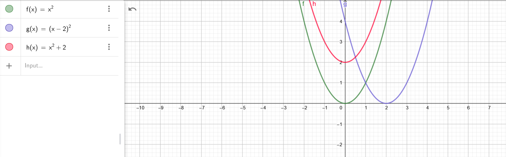
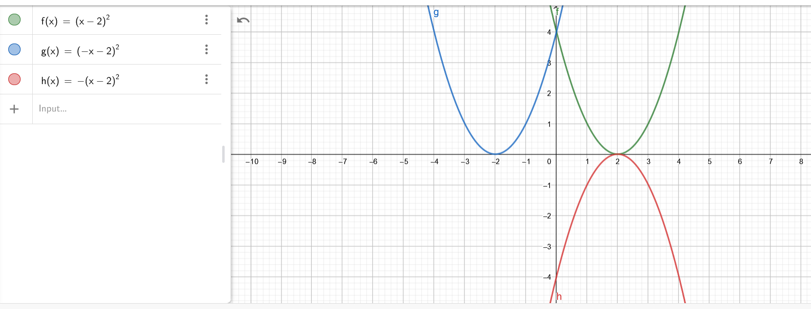

Verschuiving

y-as (vertikaal) g(x)=f(x)+a &nbsp;&nbsp;&nbsp; a &gt; 0 --&gt; boven&nbsp; ||&nbsp; a &lt; 0 --&gt; onder

x-as (horizontaal) g(x)=f(x+a) &nbsp;&nbsp;&nbsp; a &lt; 0 --&gt; rechts&nbsp; || a &gt; 0 --&gt; links

&nbsp;

Spiegeling y-as&nbsp;&nbsp;&nbsp; g(x) = f(-x) x-as&nbsp;&nbsp;&nbsp; g(x) = -f(x)

&nbsp;

Uitrekken

y-as&nbsp;&nbsp;&nbsp; g(x) = a*f(x) &nbsp;&nbsp;&nbsp; a &gt; 1: uitrekken&nbsp;&nbsp;&nbsp; 0 &lt; a &lt; 1: inkrimpen

x-as&nbsp;&nbsp;&nbsp; g(x) = f(a*x) &nbsp;&nbsp;&nbsp; a &gt; 1: inkrimpen&nbsp;&nbsp;&nbsp; 0 &lt; a &lt; 1: uitrekken

(Dit effect lijkt vreemd met paraboolfuncties (x&sup2;) dus gebruik sinus voor illustratie!

Een hoek van 360 graden = 6,28 rad = 2pi

&nbsp;

Oefeningen:

<strong>1.2 functievoorschrift</strong>

4) h(x) = x&sup2;+7

5) 

6)

&nbsp;&nbsp;&nbsp;  &nbsp;&nbsp;&nbsp;  &nbsp; &nbsp; 

7) &nbsp; &nbsp;  &nbsp; &nbsp;  &nbsp; &nbsp;  &nbsp;&nbsp; pas op met vereenvoudigen van mintekens &amp; machten/vierkantswortels

&nbsp;

9)  &nbsp;&nbsp;&nbsp; 1)  &nbsp;&nbsp;&nbsp; 2) niet gemaakt in les &nbsp;&nbsp;&nbsp; 3)  &nbsp;&nbsp;&nbsp; 4) niet gemaakt in les &nbsp;&nbsp;&nbsp; 5) niet gemaakt in les &nbsp;&nbsp;&nbsp; 6)  &nbsp;&nbsp;&nbsp; 7)  &nbsp; &nbsp; &nbsp; &nbsp; &nbsp; &nbsp;&nbsp;&nbsp;&nbsp;&nbsp;&nbsp;&nbsp;&nbsp;  &nbsp;&nbsp;&nbsp;&nbsp;&nbsp;&nbsp;&nbsp;&nbsp; (Je mag in principe ook met p werken ipv o' &amp; o". Zorg gewoon voor differentiatie bij de tussenstappen)

10)  &nbsp;&nbsp;&nbsp; 1)  &nbsp;&nbsp;&nbsp; 2) Niet gemaakt in de les &nbsp;&nbsp;&nbsp; 3) Niet gemaakt in de les &nbsp;&nbsp;&nbsp; 4) 

&nbsp;

<strong>Inverse functie: vervang (x door y) en (y door x)</strong>

(oefeningen hier zitten op p173 cursus, p117 pdf)

17)  &nbsp; &nbsp; &nbsp;

&nbsp;

(Oefeningen hier zitten op p 133 cursus, pdf teller glitched out)

23)  &nbsp; &nbsp; &nbsp;  &nbsp; &nbsp; &nbsp;  &nbsp;&nbsp; &nbsp;&nbsp;  &nbsp; &nbsp; &nbsp; 

&nbsp;

25)  &nbsp; &nbsp; &nbsp; &nbsp; &nbsp; &nbsp; &nbsp; &nbsp;  &nbsp;&nbsp;&nbsp;&nbsp;&nbsp;&nbsp; --&gt; kijk naar de x-as, die is anders dan de y-as! Vandaar dat 4 ruitjes 1 eenheid zijn &nbsp; &nbsp; &nbsp; &nbsp; &nbsp; &nbsp; &nbsp; &nbsp; &nbsp; &nbsp; &nbsp; &nbsp;

&nbsp;
