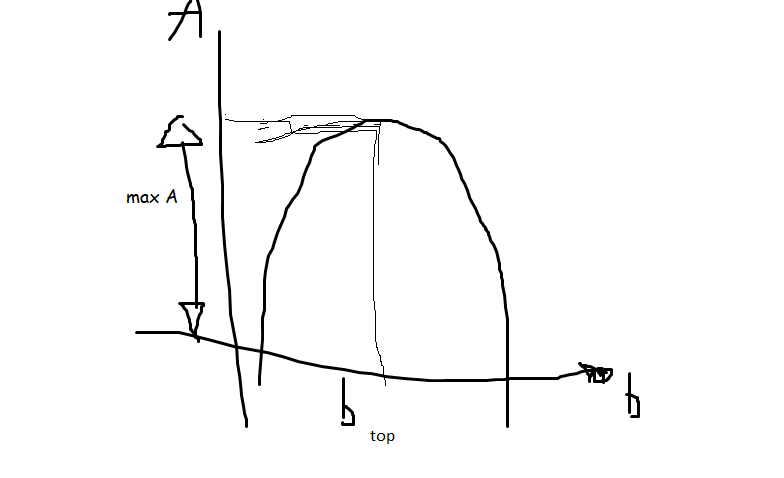

&nbsp;

&nbsp;

<strong>Cool math trick:   </strong>

&nbsp;

<strong>Oef 3</strong>

2)         

 ---

   

---

<strong>Oef 8</strong>

1) 

  

---

2) x&sup2;+9=0 x&sup2;=-9  ---

7)  

Oplossingen voor x

 (schrap beide 4s)

Controle:

[en]

 ok

<strong>Oef 6</strong>

Omtrek van rechthoek: 48m l+b+l+b (of 2l+2b) = 48&nbsp;&nbsp;&nbsp; (vergelijking (1))

2 vierkanten met zijde z 

Opp gearceerde deel in functie van b Opp gearceerde deel: A = l*b - 2*z&sup2;

l vervangen en z vervangen door b

(1)  

(2)  

Opp A: zo groot mogelijk

 a &lt; 0

(4)  (niet zeker waar deze lijn moest, maar deze stond wel op bord)

 (5)     (Iets dat we hier deden moest blijkbaar niet voor de oefening)

Oef 5

omtrek: 2l*2b=30 (1)

 (2)

(1) &nbsp;

Opp gearc deel: A

A = l*b-

 

l en r vervangen

(3) =&gt;   

Bepaalt lT en bT voor Amax

&nbsp;

lT=15-bT=15-5,385

lT=9,615m

Amax=40,389m

&nbsp;

