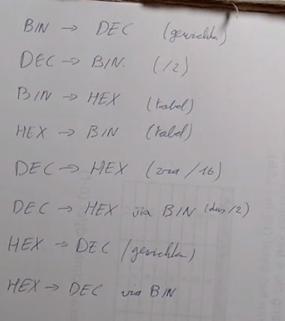

Overzicht van alle methodes(/wat we moeten kunnen?)

---

---

# Bin -> Dec

## Bin -> Dec (via gewichten)

MISSING

---

# Dec -> Bin
## Dec -> Bin (/2)

*Note: niet de methode van de leerkracht*

### Maak tabel met stappen van 2, groot genoeg om het cijfer te fitten (begin van 1)

4096 | 2048 1024 512 256 | 128 64 32 16 8 4 2 1

### Ga van links naar rechts, doe min (-) waar mogelijk, zet een 1 indien dat het geval is
bv decimaal nummer 2104

4096 | 2048 1024 512 256 | 128 64 32 16 8 4 2 1
 0      |    1      0       0    0    |     0   0  1  1 1 0 0 0

2104-2048 = 56    --> 1 bij de 2048 bit, maar een 0 bij 1024
56 - 32 = 24
24 - 16 = 8
8-8 = 0
antwoord = (1000 0011 1000)2

----

# Bin -> Hex
## Bin -> Hex (tabel)

### Teken de hex-bin tabel

### Ga van rechts naar links

bv met 1101 0001 0101

0101 = 5, 0001 = 1, 1101 = d
o = (d15)h = (d15)16 = (D15)H

Ander voorbeeld:

---

# Hex -> Bin
## Hex -> Bin (tabel)

### Teken de hex-bin tabel

### Ga (denk ik) van rechts naar lings

Voorbeeld:

---

# Dec -> Hex
## Dec -> Hex (via binair tabel)

*Note: terug niet methode van leerkracht*

Doe eerst [dec->binair](#Dec -> bin (/2)), doe daarna [binair->hex](#Bin -> Hex (tabel)) (werkt vooral voor kleinere getallen (< +/- 2048))

## Dec -> Hex (via /16)

Voorbeelden van leerkracht

## Dec -> Hex (via BIN, dus /2)

Bekijk de deelbaarheid van het getal door 2

- Indien deelbaar: 0
- Indien niet deelbaar: 1

Repeat dan met het resultaat van de deling van 2 (met de ,5 ommitted indien die er was)

----

# Hex -> Dec

## Hex -> Dec (via gewichten)

MISSING

## Hex -> Dec (via Bin)

---

---

# Extra links

https://learningcontent.cisco.com/games/binary/index.html
